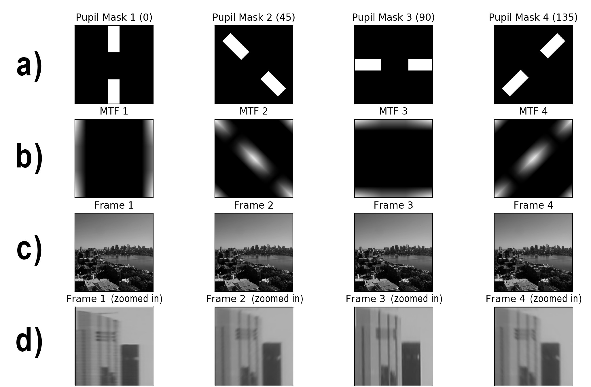
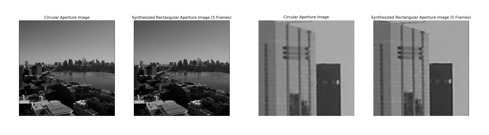
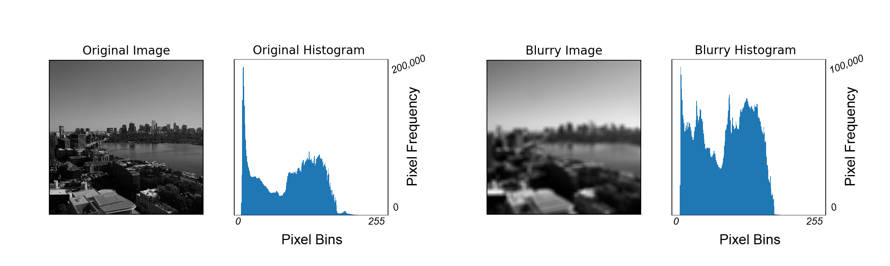

<a href="https://zduguid.github.io">
    
</a>


# REIF-SAT Image Processing
The goal of the Rectangular Earth-Imaging Fast-Spinning Aperture Telescope (REIF-SAT) project is to demonstrate the feasibility of a spinning-aperture space telescope that is capable of producing high quality images that are of equivalent resolution to the images produced by an equivalent length circular aperture system. REIF-SAT is the deliverable of MIT's Aerospace Engineering capstone course for undergraduate students: 16.83 - Space Systems Engineering. To demonstrate the feasibility of a spinning-aperture space telescope, image processing algorithms must be developed to synthesize a high resolution image from a series of individual frames.


## Table of Contents
- [Getting Started](#getting-started)
    - [Dependencies](#dependencies)
- [Image Processing](#image-processing)
    - [Frame Generation](#frame-generation)
    - [Wiener Filter](#wiener-filter)
    - [Synthesis Accuracy](#synthesis-accuracy)
    - [Helpful OpenCV and NumPy Commands](#helpful-commands)
- [Future Work](#future-work)
- [Acknowledgements](#acknowledgements)


## Getting Started 
The image processing software tool found in this repository represents the initial phase of testing for the REIF-SAT project. As such, the software tool currently operates on a predetermined test image image as opposed to operating on live images taken directly from an optical system. From this test image, a series of artificial frames are generated to simulate the effect of using a spinning rectangular aperture system. Then, these frames are synthesized using a Wiener Filter approach.


### Dependencies
To run the image processing algorithm on your machine, namely ```wiener_filter.py```, the following dependencies must be satisfied: 
* The image processing script is written in ```Python3``` [(Python3 Download)](https://www.python.org/downloads/)
* ```NumPy``` is used to create array objects for graphing and to manipulate images [(NumPy)](http://www.numpy.org)
* ```OpenCV``` is used for reading, manipulating, and displaying images [(OpenCV)](https://opencv.org)
* ```imutils``` is used for image rotations [(imutils)](https://github.com/jrosebr1/imutils)
* ```matplotlib``` is used for creating custom plots [(matplotlib)](https://matplotlib.org)


## Image Processing 
To demonstrate the feasibility of the REIF-SAT image processing software, a set of artificial frames are generated to simulate the effect of the spinning rectangular aperture system. Then, a Wiener Filter algorithm is used to reconstruct the set of frames into a high-resolution synthesized image.


### Frame Generation 
Before generating the set of frames, an aperture pupil mask is created to represent the shape and orientation of the rectangular aperture. Once the pupil mask is created, the set of frames is created by rotating the mask across a series of linearly spaced angles between 0 and 180 degrees, computing the modulation transfer function (MTF) associated with each rotated pupil mask, and then multiplying each MTF with the original test image to produce each frame. By doing so, frames are shown to have high resolution in the direction parallel to the rectangular aperture orientation and low resolution in the direction orthogonal to the rectangular aperture orientation. The figure below demonstrates the frame generation process.




### Wiener Filter
To reconstruct the series of frames into one high-resolution synthesized image, a Wiener Filter approach is utilized. As such, a Wiener Filter is created using the MTFs for each pupil mask orientation utilized in the frame generation process. Next, the frames are summed in the frequency domain, the sum is pairwise multiplied with the Wiener Filter, and then this result undergoes an inverse Fourier transform to yield the filtered image in the spatial domain. The figure below showcases the performance of the of the Wiener Filter synthesis compared to the results of a circular aperture system.




### Synthesis Accuracy
To determine the synthesis accuracy of the of the Wiener Filter approach, a comparison method involving image histograms is utilized. An image histogram comparison method is utilized because it has the useful property that it is rotation invariant. The figure below highlights how the histogram profile of an image is related to the blurriness of the image.



Once the image histograms are determined, the histogram profiles are treated as high dimensional vectors where each histogram bin represents a dimension and the pixel frequency in each histogram bin represents the corresponding vector magnitude in that dimension. Using this formulation, the dot product between the two histogram profiles is taken to yield the angular difference between two histogram vectors. Thus, to calculate the image synthesis accuracy of the Wiener filter approach, this vector-histogram calculation is performed with the circular aperture system test image and the high-resolution synthesized image. The following figure demonstrates how the number of frames considered in the synthesis process effects the overall synthesis accuracy. Note that a smaller histogram angle indicates higher accuracy. Interestingly, the greatest synthesis accuracy is observed when eight frames are considered. It is hypothesized that this result is observed due to an aliasing effect a large number of frames are considered.


### Helpful OpenCV and NumPy Commands
* Read in an image file in black and white:
    * ```img = cv2.imread('img_file', 0)```
* Read in an image file in color:
    * ```img = cv2.imread('img_file', 1)```
* Split color channels of a color image:
    * ```b,g,r = cv2.split(img)```
* Merge color channels into one array:
    * ```rgb = cv2.merge([r,g,b])```
* Get the dimensions of an image: 
    * ```print(img.shape)```
* Convert the image file from spatial domain to frequency domain:
    * ```freq_img = np.fft.fft2(img)```
* Convert the image file from frequency domain to spatial domain:
    * ```img = np.fft.ifft2(freq_img)```
* Get complex conjugate of frequency domain array:
    * ```conj = np.conjugate(freq_img)```
* Shift an image in the frequency domain:
    * ```fshift = np.fft.fftshift(freq_img)```


## Future Work
The Wiener Filter synthesis algorithm described in this repository has only been tested with pre-specified test images. Thus, moving forward it will be useful to pursue experiments that embody more realistic operational conditions. Also, more thought should be given to the methods used when calculating synthesis accuracy in order to derive appropriate system requirements.

## Acknowledgements
* Massachusetts Institute of Technology
* MIT Lincoln Laboratories
* Jet Propulsion Laboratory
* Faculty and staff for 16.83, Space Systems Engineering 

